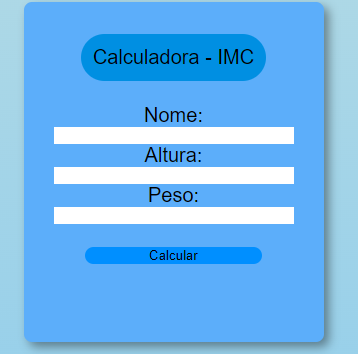

# Calculadora-IMC
**"IMC é a sigla para Índice de Massa Corpórea, parâmetro adotado pela Organização Mundial de Saúde para calcular o peso ideal de cada pessoa"**

## Descrição do Projeto:
Nesse projeto é informado o IMC após o usuário informar dados de peso(Kg) e Altura(M), retorna também em qual faixa o IMC do usuário se encontra.

## Tecnologias usadas
- JavaScript: para o gerenciamento e calculo das informações.
- HTML: Para marcação;
- CSS: Para estilização.

## Como Usar
- Faça o download do diretório ou clone para sua maquina;
- Abra o aplicativo em um navegador da web;
- Informe seus dados: nome, altura e peso.

## Autor
- Eu :), com ajuda de alguns videos do youtube.

